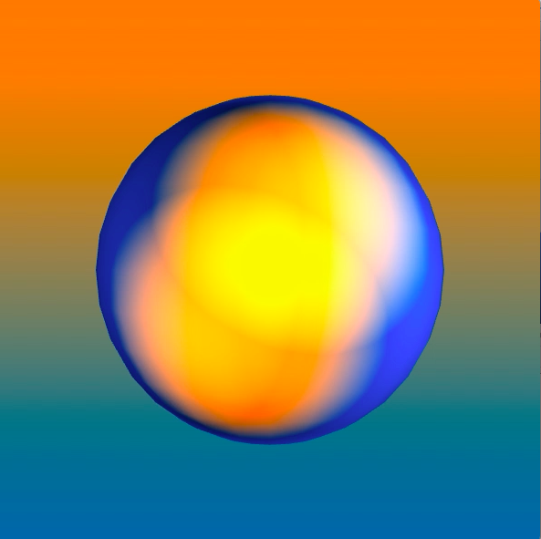

6월에 있을 전시를 위해서 작업을 구상하고 있다. 

최근에 명상 앱(코끼리)을 다운 받아서 2주동안 사용해보았는데, 심리 상담 치료법과도 유사한 부분들이 있어서 그런지 스트레스를 완화시키는 데에 효과적이었다. 그 경험을 바탕으로 mental health 에 관련된 작품을 만들어 보려고 구상중이다.

이직한 회사가 분위기도 사람들도 좋아서 큰 트러블은 없었는데, 잘 모르는 업무에 대한 부담감이나 공부량에 대한 압박감이 생각보다 점점 커지면서 스트레스를 받은 듯 했다. (같은 분야에서 이직을 자주 해본 친구는 보통 이직하고 나서 '가면 증후군' imposter syndrome 이 잘 나타난다고 그랬다.) 가면 증후군까지는 아니었더라도, 내 능력치에 대한 불만족이나 불안감이 쌓이는 와중에, 코로나 때문에 운동이나 소셜 활동도 많이 못해서 스트레스를 풀 곳이 마땅하지 않았던 것 같다. 그리고 멀티가 잘 안되는 나는, 가끔 공부나 성장에 대한 압박이 심해지면 소셜 활동을 확연히 줄여버려서 outlet이 더 줄어드는 바람에 나중에야 스트레스를 인지하는 경우도 있는 듯 하다.

한국에서도 명상이 조금씩 유행을 타고 있었는데, 코로나 블루로 사회적, 개인적 스트레스가 증가하면서 더 각광을 받고 있는 것 같다. 특히, 종로의 힙한 갤러리 피크닉에서도 mindfulness 라는 주제로 차분한 전시를 기획한 걸 보면 말이다.

**코드에 대한 세부 설명은 다음 포스팅에서 이어갈 예정이다**

## 구상도 
전체적인 기술적 구상은 이렇게 생각중이다.
아두이노 하드웨어를 사용한 시그널 -> p5 js 소프트웨어 프로그램 -> 잔잔하고 차분한 비쥬얼의 변화

명상이나 심리 치료에서 피지컬한 부분은 호흡이다.
호흡을 조절하는 것만으로도 긴장과 불안감이 매우 줄어든다는 걸 실감한다. (아마 요가도 비슷할 것 같다.)
그래서 날숨 호흡을 시그널로 보낼 생각이다. 깊은 들숨과 날숨의 템포를 비쥬얼로 조절하고, 참여자의 날숨 시그널에 따라 프로젝션 비쥬얼을 변화시키려고 한다. 

## 비쥬얼 
명상 앱에서 들숨날숨을 연습시킬 때, 차가운 공기를 마셔서 내 몸의 온기로 따뜻한 공기를 내뱉는다. 
그리고 어두운 회색 구름이었던 환경이 나의 따뜻한 날숨으로 인해 점점 밝아진다.

[Zach Lieberman](https://www.instagram.com/zach.lieberman/) 아티스트/교수가 amber, blue 색깔을 이용한 작업을 예전에 많이 했었다. 전에는 그 색들이 딱히 예뻐보이지도 않고 왜 많이 쓰는지 이해가 안되었는데, 나중에 모두연 인터렉티브아트랩에서 lighting 관련 p5js 코드 튜토리얼을 만들다가 불현듯 깨달았다. 

내가 예전에 무대조명을 했을 때도, 거의 모든 조명의 베이스는 amber, blue 였다. 이렇게 약간 따뜻한 색감과 약간 차가운 색감은 크게 튀는 부분 없이 그 상황의 분위기(아침/저녁, 온화/냉랭)를 은은하게 연출해준다. 그리고 둘을 합치면 우리가 흔히 보는 neutral 한 하얀 조명이 된다. 

동시에 자연에 매우 가까운 색이라는 생각이 들었다. 내가 발리 여행을 갔을 때, 바다에서 sunrise 사진을 많이 찍었는데, 사진들을 한참 보다보니 주황색과 파랑색이 주를 이루었다. 

amber, blue 가 사람에게 가장 친숙하고 자연스러운 대표적인 색감들이 아닌가 싶다.

현재까지 구상하고 개발한 비쥬얼이다. 3D sphere, lighting 색감을 정해가고 있다.
[짤막한 모션 영상](https://www.instagram.com/p/CAAaueGjkPv/)

## inspiration
주된 영감이 호흡과 색감과 시대상이라면, 표현 방식에 대한 영감은 james turrell, olafur eliasson 이다. 

james turrell 은 PS1MoMA 등 여러 갤러리나 박물관에 전시되는 등 아주 유명한 작가이다. 
넷플릭스 david letterman - kanye west 인터뷰에서는 칸예가 주일 예배 sunday service 하는 찬양 공간을 james turrell 에게 영감 받아서 쨍한 조명의 힐링되는 분위기로 연출했다는 내용이 있다. 그걸 최근에 보고, 나의 조명 경험이 겹쳐지면서 인상이 깊게 남았었다.

olafur eliasson 도 예전부터 알았던 건축 배경의 작가이다. 작년에 넷플릭스에서 olafur 관련 다큐를 보고, 런던에서 하는 특별 전시 사진들을 보고 많은 감동을 받았었다. 

둘의 공통점을 간단하게 설명한다면, 하나의 큰 공간을 자연의 색이나 일관된 조명으로 가득 채우고 관객에게 그 경험을 맡긴다는 것이다.
내가 그들에게서 영감받은 부분을 정리한다면, 단순함, 공간성, 자연스러움...?

## 잡담
지금까지 VR, AR, interactive JS 등 다양한 작업과 전시를 하면서 나의 주된 테마는 **2인 이상이 모여서 '함께' 즐길 수 있는 놀잇감을 주는 것** 이었다. 
문화 특성에 따라 낯선 사람들끼리도 잘 노는 관객들이 있고, 어색해서 시도조차 안하는 관객들이 있었다. 내가 제공한 '놀잇감'의 부족함도 이유일 것이다. 

그런데 이번에는 혼자 참여하는 작업을 시도해보려고 한다. '같이' '함께' 라는 개념은 여전히 중요하게 생각한다. 하지만 코로나가 불러온 언택트 시대, 여러모로 스트레스가 증가하는 시대, 1인 경제인구가 증가하는 시대는 혼자서 많은 것을 감당해야 하는 환경이다. 그리고 개인의 문제 - 트라우마든 자존감이든 불안감이든 - 가 해결되지 않은 상태에서는 외부의 일이나 관계가 부담스러워진다. 혼자서 해결하라는 맥락이라기보다는... 나의 중심이 잘 잡혀있기 위해서는 자신의 내면을 꾸준히 신경써줘야 한다는 생각에 이번 테마는 다소 달라질 것 같다.
