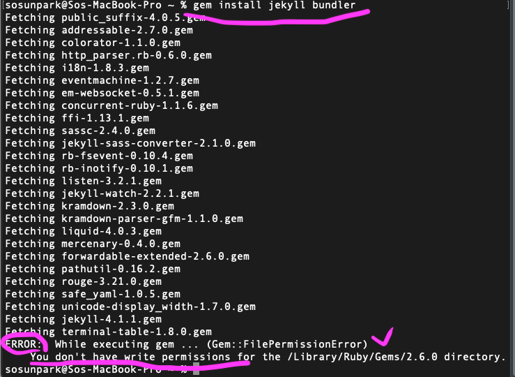
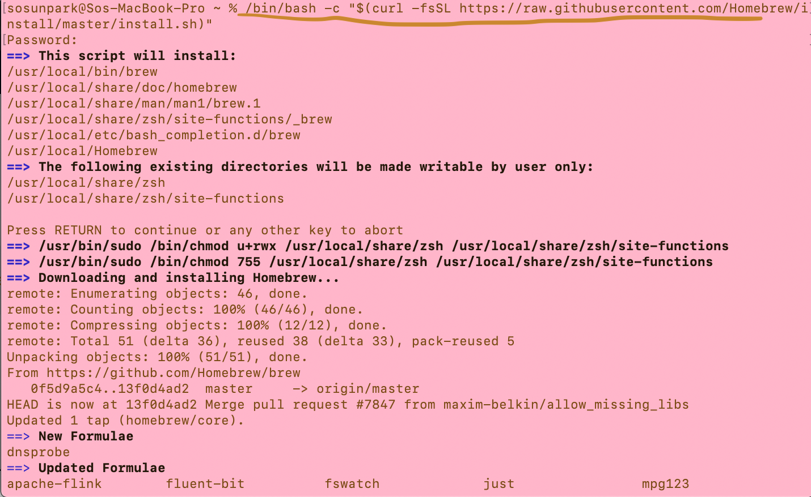
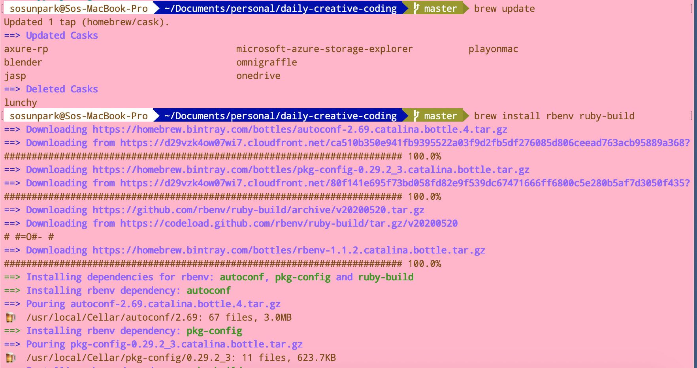
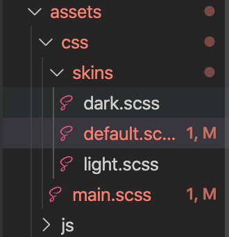
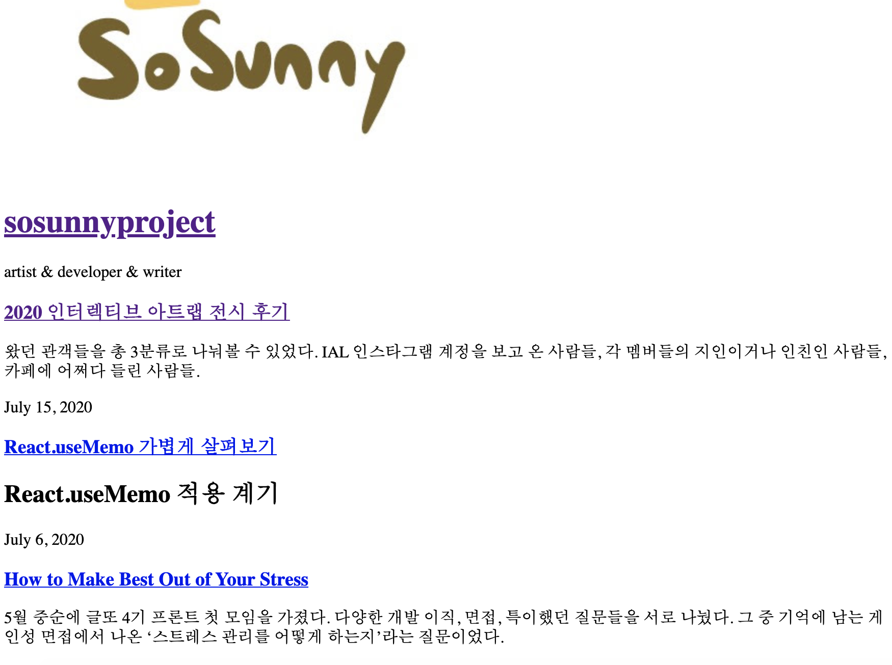
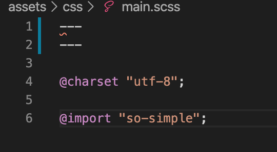
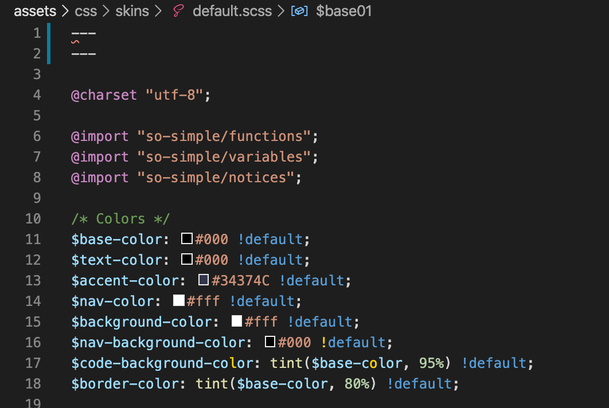
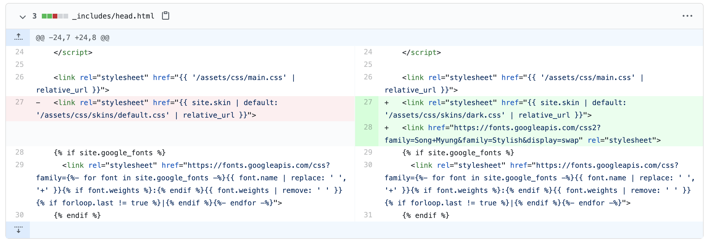

# Customize Jeykyll Github Blog

현재 깃헙 블로그 테마로 [so simple](https://github.com/mmistakes/so-simple-theme)을 쓰고 있다. 
ruby 기반의 jekyll은 너무 생소해서 처음에도 겨우 깃헙 블로그를 셋업했고, 그 후에 커스터마이즈 하는 것도 손이 잘 가지 않았다. 

방치하고 있었는데, 글을 쓰면 쓸수록 블로그 appearance 가 점점 마음에 안들어서 전시가 끝난 후에, 드디어 마음 잡고 수정을 하기 시작했다. 

## 준비 단계: 로컬에서 jekyll 서버 실행하기

실시간으로 코드를 수정하고 반영하면서 블로그 테마를 커스터마이징 하려면 로컬에서 서버를 돌리는 게 훨씬 효율적이라 생각해서 로컬에 지킬을 설치했다. 
평소에 블로그 글을 쓰고 github 에 push 하는 것처럼 체크했다면, jekyll 에서 어떤 css 파일을 고쳐야 하는지도 낯선 상황에서 엄청 오래 걸렸을 것이다.  

1. ruby, gem 설치를 하고 나서 `gem install jekyll bundler` 실행하려는데, [`jekyll command not found` 혹은 permission 에러가 났다.](https://stackoverflow.com/questions/51126403/you-dont-have-write-permissions-for-the-library-ruby-gems-2-3-0-directory-ma)

<figure style="display: block; margin: 0 auto; text-align: center">

<figcaption><em> 퍼미션 에러 ㅠㅠ </em></figcaption>
</figure>

2. 아무래도 rbenv 로 재설치해야 할 것 같아서, `brew uninstall ruby` 로 uninstall 했다. (퍼미션이 없다고 해서 sudo 로 설치하는 방법은 매우 지양됨)

3. ruby 재설치 
<figure style="display: block; margin: 0 auto; text-align: center">

<figcaption><em> 위 명령어는 deprecated</em></figcaption>
</figure>

<figure style="display: block; margin: 0 auto; text-align: center">

<figcaption><em>homebrew 웹사이트 참조 https://brew.sh/</em></figcaption>
</figure>

4. [`rbenv` 환경에서 jekyll 설치 및 블로그 생성하는 과정](https://lhy.kr/create-jekyll-blog-using-rbenv-and-github-pages)을 통해서 
지킬 블로그를 성공적으로 로컬 서버에서 실행했다.

<figure style="display: block; margin: 0 auto; text-align: center">

<figcaption><em>rbenv 설치</em></figcaption>
</figure>

5. 제대로 설치하고 나서도 `jekyll serve` 명령어가 안 먹혀서 구글링을 하다가, [`bundle install` 설치 후, `bundle exec jekyll serve` 로 실행](https://github.com/ColaMakerspace/ColaMakerspace.github.io/issues/12)하니 드디어 로컬 서버 실행 성공-! 

#### 참고한 기타 링크들
- [install ruby with rbenv](https://gist.github.com/stonehippo/cc0f3098516fb52390f1)
- [change ruby version](https://stackoverflow.com/questions/54977098/how-to-change-which-version-of-ruby-i-am-using/54977206)

# 실전: css, scss 임포트 설정

css 수정하기에 앞서, 파일 자체가 적용이 안되는 에러가 발생했다.

### 🚫 ERROR `assets/css/main.css` not found

##### 나한테는 소용없었지만, 다른 해결방법들
- 내 디렉토리를 보면 css 파일은 하나도 없고, scss 파일만 있었다. scss는 제대로 건드려본 적이 없어서 생소했다.
- `_config.yml` 파일에서 url 이나 baseurl 셋팅이 제대로 안 되어있는 경우, css 가 안먹힌다. 하지만 내 경우에는 다 정상적으로 설정되어 있었다.
- `_config.yml` 에서 [scss 파일 설정을 위해 `sass_dir` 등을 지정하는 것](https://kgmyh.github.io/blog/2017/12/23/Jekyll_Using_Sass/)도 소용 없었다.
- 혹시나 지킬 버전이 1.0 이하라면, [scss 파일 자체를 읽지 못한다](https://github.com/jekyll/jekyll/issues/3957)

~~도대체 뭐가 문제야!!!😿~~

### ➡️➡️ 해결방법: scss 파일 위에 - - - 쓰기

scss 설정 관련해서 수많은 글을 읽었을 때마다 (심지어 위에 첨부한 링크 중 하나에서도 나오는 방법) 나온 해결법이었는데 너무 사소해보여서 간과했다.

위 캡쳐본은 심지어 [지킬 공식 블로그](https://jekyllrb-ko.github.io/docs/step-by-step/07-assets/)에서 해주는 설명이다. 컴파일 과정에서 왜 --- 가 꼭 필요한지는 의문이지만, scss 파일에 이걸 다 넣어주고 나니 제대로 작동되었다.

사실 저걸 시도했다가 지웠었는데, 아래처럼 내 vscode 에서 syntax error 인 것처럼 표시가 떠서, 이게 아닌가 보다 했었다.

<figure style="display: block; margin: 0 auto; text-align: center">

<figcaption>root 폴더 아래 > assets 폴더</figcaption>
</figure>

<figure style="display: block; margin: 0 auto; text-align: center">

<figcaption>css 깨졌을 때 블로그 ㅠㅠ</figcaption>
</figure>

⬆️한동안 이 상태로 끙끙 대다가, 내가 메인 스킨으로 적용한 scss 파일들을 싹 바꿔주니,

<figure style="display: block; margin: 0 auto; text-align: center">

<figcaption><em>main.scss 파일은 _sass폴더 하위애 있는 so-simple.scss를 참조한다.</em></figcaption>
</figure>

<figure style="display: block; margin: 0 auto; text-align: center">

<figcaption> <em> 테마 중에 default.scss 적용 </em> </figcaption>
</figure>

## 짜잔~~ 💫💫

<figure style="display: block; margin: 0 auto; text-align: center">

<figcaption>사실 이건 css를 더 더 더 수정하고 나서의 결과</figcaption>
</figure>

# 번외: 테마 바꾸기 🎨

so-simple 테마에는 light.scss, default.scss, dark.scss 이렇게 세 가지 테마가 있다. default 말고 dark 로 바꾸고 싶었다.

아래 그림처럼 dark.css 로 설정을 바꾸고, dark.scss 파일 말머리에도 --- 를 넣어줬다.

*(추가로 폰트도 바꾸고 싶어서 임포트했다.)*

<figure style="display: block; margin: 0 auto; text-align: center">

<figcaption>stylesheet 변경</figcaption>
</figure>

#### References

- [jekyll not reading scss](https://talk.jekyllrb.com/t/jekyll-is-not-compiling-scss-files/788/2)
- [jekyll 공식 블로그: assets 설명](https://jekyllrb-ko.github.io/docs/step-by-step/07-assets/)
