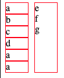
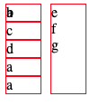
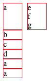
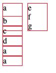
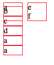

# 적용 케이스

핀터레스트와 같이 column 별로 어긋난, unbalance 한 그리드 스타일을 적용해야 했다.

최대한 javascript, jquery 는 사용하지 않고 css 로만 만드는 것이 우선순위였다.

구현하고자 했던 모양은 아래 이미지와 같았는데, 오른쪽 column의 카드가 줄어드냐 늘어나냐에 구애받지 않고 왼쪽 column 의 정렬은 유지되어야 했다.

⬇️⬇️e,g,f 의 높이나 존재 유무에 관계없이 왼쪽 라인은 왼쪽끼리, 오른쪽은 오른쪽끼리 세로로 잘 정렬되는 것이 목표⬇️⬇️

<figure style="display: block; margin: 0 auto; text-align: center">

<figcaption>원하는 완성 형태</figcaption>
</figure>

- [stackOverflow](https://stackoverflow.com/questions/45436398/css-grid-auto-placement-in-ie-edge) 에서 Grid auto replacement 는 ie 에서 안먹는다고, nth-child 로밖에 못하나 해서 완전 맥빠졌음

- 1차 시도: flex, grid 를 섞어서 ➡️ 실패

<figure style="display: block; margin: 0 auto; text-align: center">

<figcaption>ie에서 여러 div 들이 겹쳐지는 문제 발생 - 초기에는 위 아래 오른 왼 다 겹치고 난리도 아니었다</figcaption>
</figure>

- 수정의 수정을 거쳐서, 준 완성 단계로 왔으나 2%가 부족하다. 이렇게 efg 의 총 높이가 왼쪽 칼럼에 영향을 주지 않기를 바라는 부분...

<figure style="display: block; margin: 0 auto; text-align: center">

<figcaption>거의 다 와간다...!</figcaption>
</figure>

- 2차 시도: left-bottom 의 속성에 ```position: relative; top: -100px``` 혹은 ```position: fixed; top: 620px``` 을 주었다.
  - 두 경우 모두, 오른쪽 칼럼의 카드들의 총 높이에 영향을 받았다. 
  - position 은 최후의 수단에만 사용하자는 피드백을 들어서 쓰지 않기로 했다.

<figure style="display: block; margin: 0 auto; text-align: center">

<figcaption>뭔가 그럴싸해보이나...</figcaption>
</figure>

<figure style="display: block; margin: 0 auto; text-align: center">

<figcaption>오른쪽 칼럼이 바뀌면 망가져버림</figcaption>
</figure>

- 3차 시도: 성공 ! (선임이 도와주었다...)
  - 핵심: right-grid-wrap 에다가 ```grid-row-end: 3;``` 끝나는 값을 3 이상을 주어야지 오른쪽 칼럼의 전체 높이를 독자적으로 차지했다. 그래서 왼쪽 칼럼에 영향을 안주는 효과가 나타났다.

<figure style="display: block; margin: 0 auto; text-align: center">

<figcaption>성공</figcaption>
</figure>

# 유용한 참고 사이트

[1분코딩 블로그 CSS Grid 익히기](https://studiomeal.com/archives/533)

➡️➡️ 예전에 html, css, animation 을 공부하다가 찾았던 유튜브, 인프런 강의를 하시는 분 블로그인데
설명도 친절하고 내용도 다양하다.

ie 11 을 지원해주고 싶은데 css 속성 property name이 헷갈릴 때 유용한 사이트는 요기 ➡️  https://autoprefixer.github.io/


# 코드 데모
코드펜 데모: https://codepen.io/sosunny/pen/QWNQzeN?editors=1100

순수 html, css 코드는 아래에 ⬇️⬇️

```html
<!DOCTYPE html>
<html lang="en">
<head>
  <meta charset="UTF-8">
  <meta name="viewport" content="width=device-width, initial-scale=1.0">
  <title>Document</title>
  <link rel="stylesheet" href="test.css">
  <style>
  .container{
    display: grid;
    grid-template-columns: 1fr 1fr;
    
    display: -ms-grid;
    -ms-grid-columns: 1fr 10px 1fr;
    -webkit-column-gap: 10px;
    -moz-column-gap: 10px;
    
    column-gap: 10px;
  }

  .grid-left-top{
    grid-column-start: 1;
    grid-row-start: 1;
    
    -ms-grid-row: 1;
    -ms-grid-column: 1;
  }

  .grid-right-wrap{
    grid-row-start: 1;
    grid-row-end: 4;
    
    -ms-grid-row: 1;
    -ms-grid-row-span: 4;
  }

  .grid-left-bottom {
    grid-row-start: 2; 
    -ms-grid-row: 2;
  }

  .item{
    border: 1px solid red;
  }
  </style>

  <body>
  <div class='container'>
    <section class="grid-left-top item">a</section>
    
    <div class='grid-right-wrap item'>
        <section>e</section>
        <section>f</section>
        <section>g</section>
    </div>
    
    <div class="grid-left-bottom">
      <section class="item">b</section>
      <section class="item">c</section>
      <section class="item">d</section>
        <section class="item">a</section>
        <section class="item">a</section>
    </div>
  </body>
</html>
```

### flex 관련 링크
- https://flaviocopes.com/flexbox/
- 